# Actual environment render evidence

Source 555bbf75cf51902f70ecd767504740f66dce1688; tested merge d028bcf5074f1fca892e8c63e25b03b1d1342867; Actions run 34183959350.

These are unaltered Godot Mobile/software-Vulkan frames, not a physical-device FPS benchmark or a visual approval.

## mobile-left

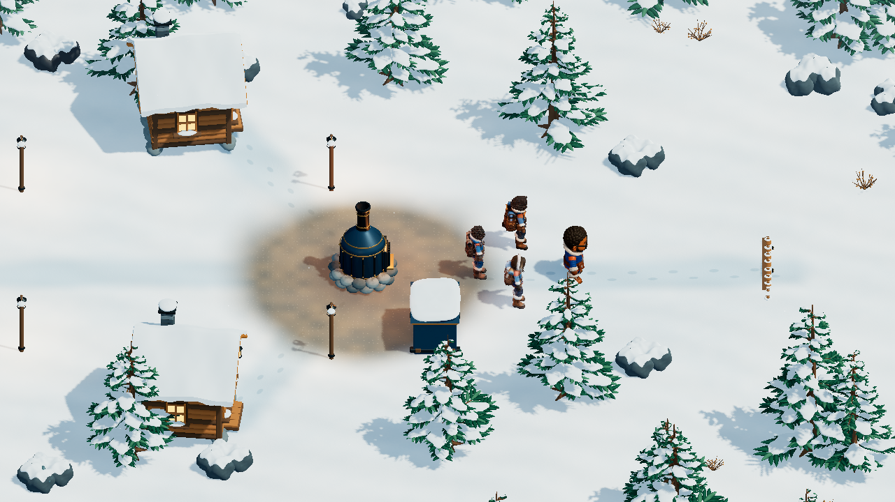

## mobile-rear

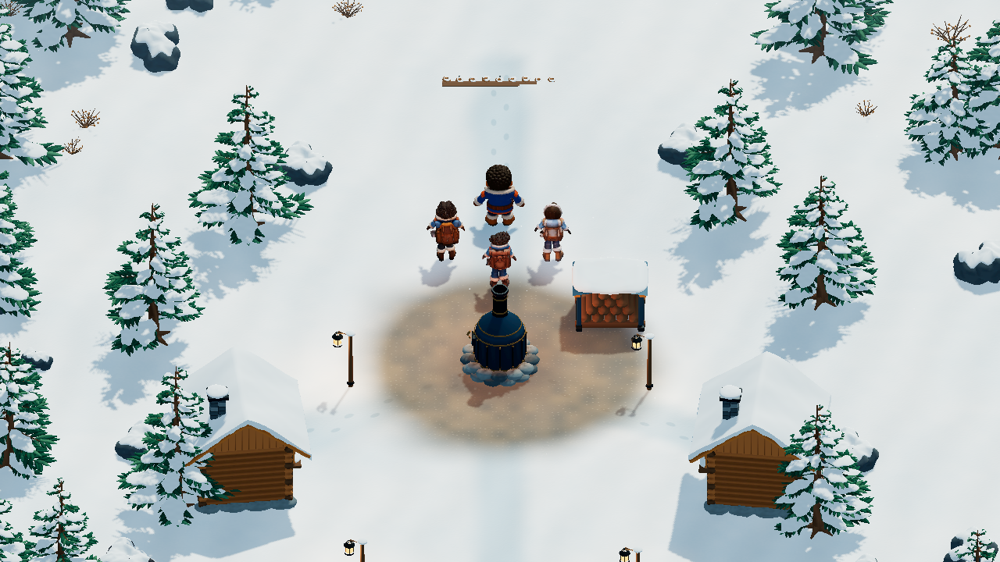

## mobile-render

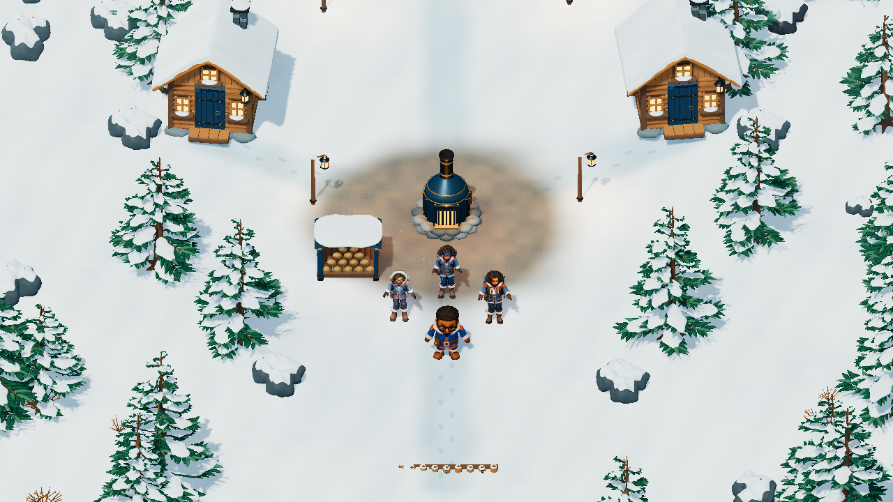

## mobile-side

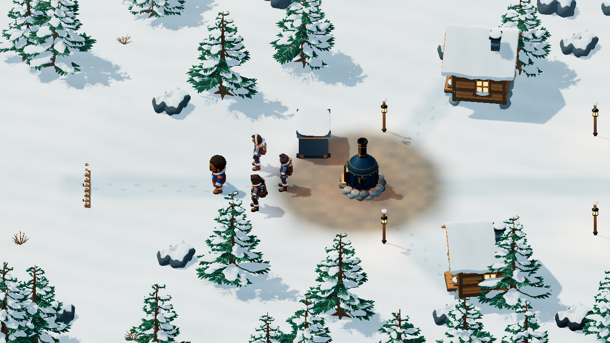

## mobile-three-quarter

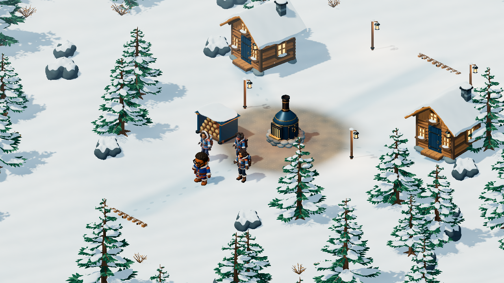

## outpost-blizzard

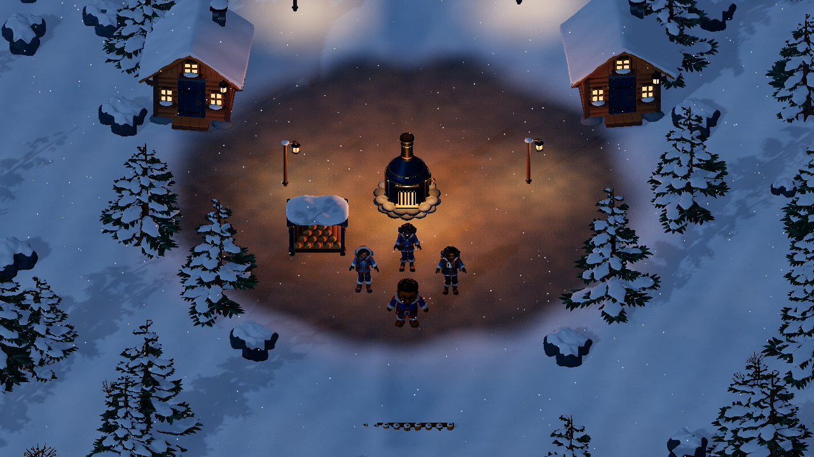

## outpost-furnace-detail

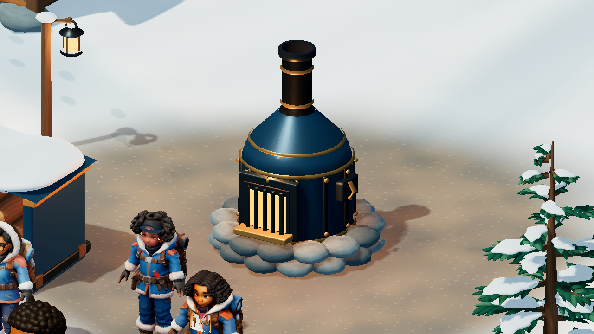

## outpost-gather

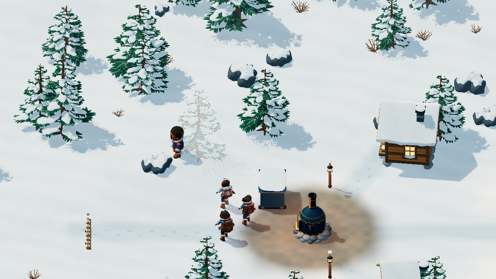

## outpost-native-4k

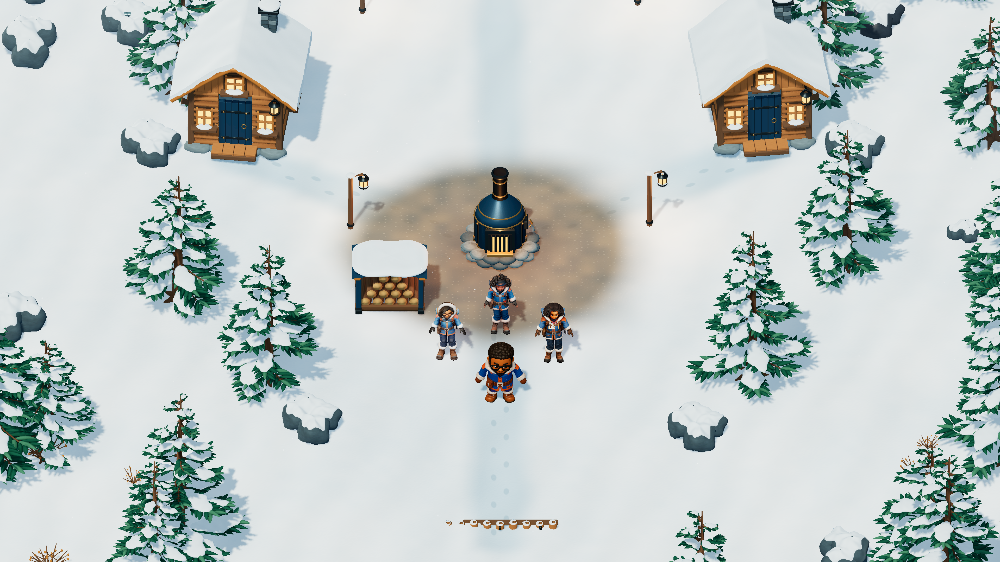

## outpost-night

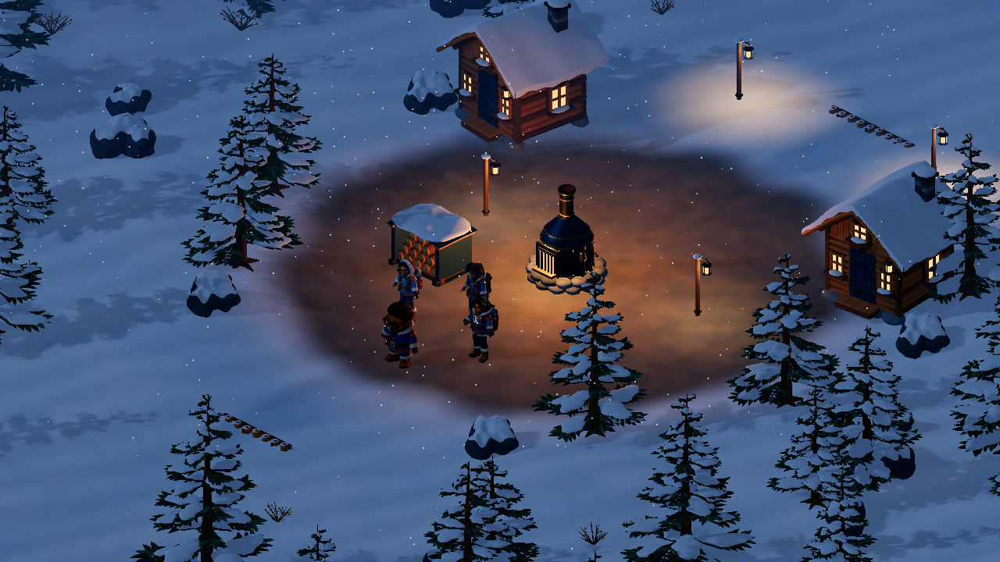

## outpost-shelter-detail

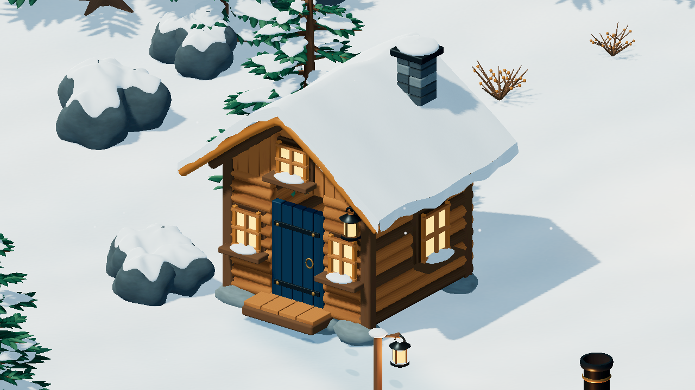

## outpost-shelter-detail-rear

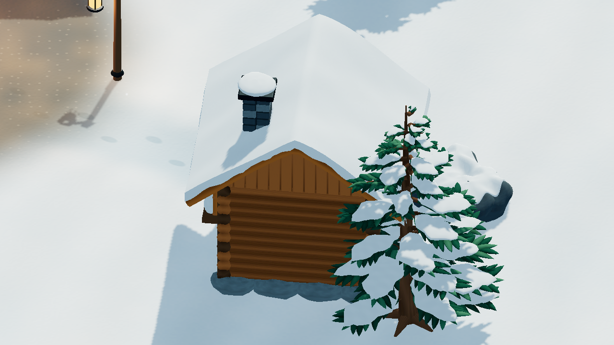

## outpost-tree-detail

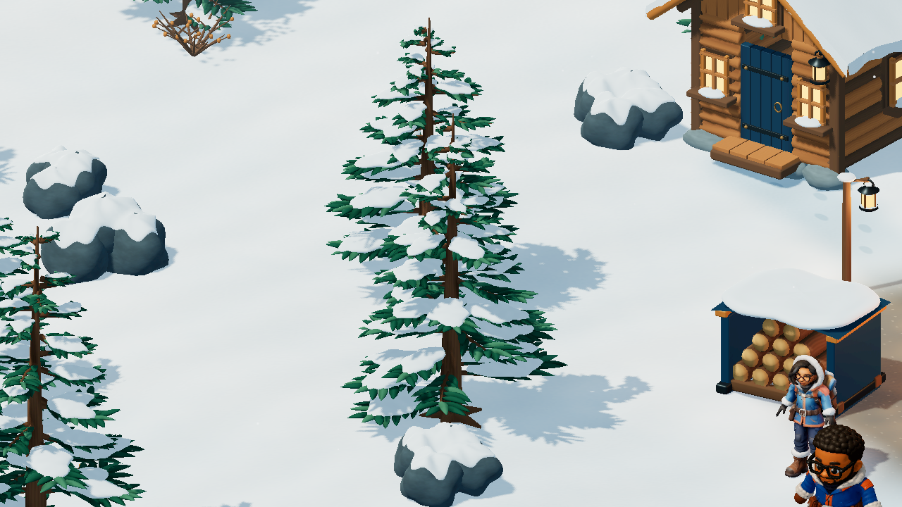

## outpost-warmth4

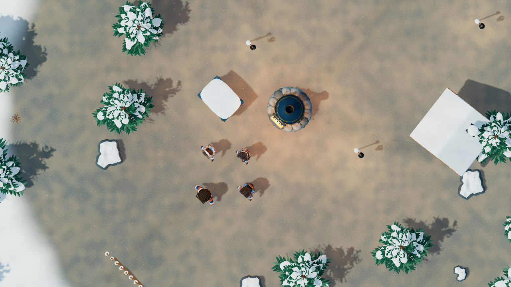
